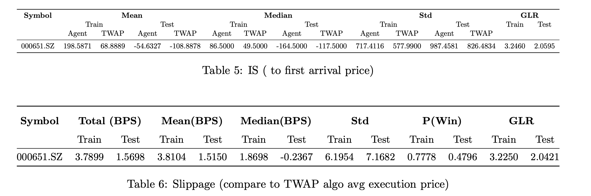

# Order-Placement-With-Deep-Reinforcement-Learning

## Introduction 
This project focuses on trading execution within a short time horizon. 
The trading instruction is to sell Q number of shares of XYZ stock within 1 minute from 9:31 to 9:32, 
which is the beginning of the continuous trading session of a trading day in China. The chosen benchmark is the TWAP algorithm. 
The Q is set to the level ensuring that the trading algorithm has its role to play. 
If the Q were too small, the trading task would become too easy that it is impossible to achieve a better result. 
If the Q were too large, the trade task would consume a lot of liquidity on the market making the experiment unreasonable.
Generally, a participation rate of 5% to 6% is believed to be a reasonable trading volume 
that causes a small impact as well as has the potential to optimize the trading behavior \[See the book Algorithmic Trading and DMA: An introduction to direct access trading strategies\]. 

## Assumptions
In this project, it is assumed that the trading agent only trades via MO orders. 
The second assumption is that the agent is able to capture the limit orders it observes in no time and the order is matched according to the price priority principle: the order is first executed as the best bid price then dives into the second-best price available until the order is fully filled. Furthermore, it is assumed that the only way for the agent to cause a market impact is by walking the limit order book, which is the only reason that leads to an inferior traded price at a time step. And the author assumes that the market is resilient and the agent’s action does not leak any information to other participates on the market; thus the agent’s action does not change the market condition of the next time step.

## Data

Data used in the experiment is he level 1 data from June 1st, 2019 to Jun 1st 2020 of selected China A shares. The data from June 1st, 2019 to the end of December is the training sample and the rest left for testing. So far, experiment has been only carried on 000651.SZ. Q = 60 lots.

## Trading Behaviour 

## Backtest result 

